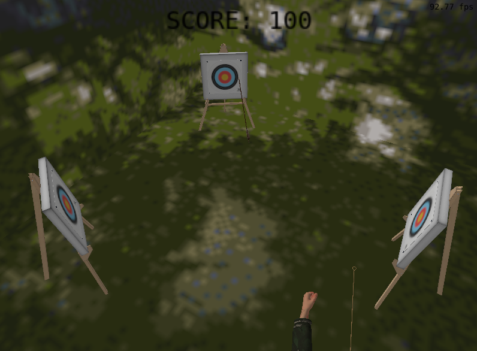
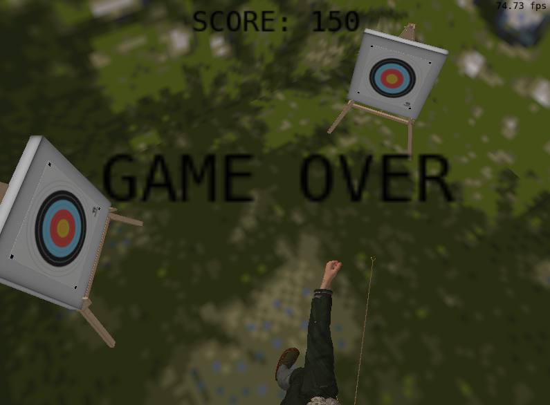
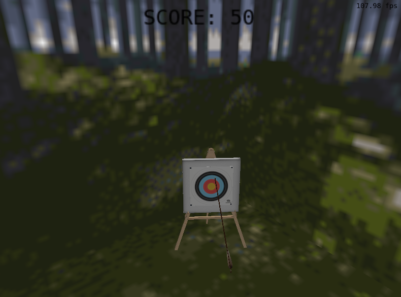
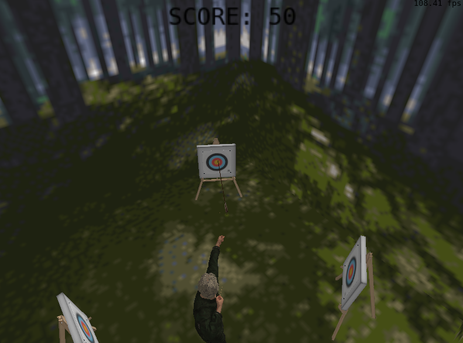

# Final-Project-FCG
Projeto Final de Fundamentos de Computação Gráfica - INF01047
- Professor: Eduardo Gastal
- Integrantes: Gisele Rotta e Isadora Vidor
- [Vídeo no Youtube](https://youtu.be/k9etKqTP_pg)

Como trabalho final da cadeira de Fundamentos de Computação Gráfica, implementamos um jogo de arco e flecha, que consiste em 5 tentativas dadas ao jogar para acertar os alvos em cena.

<p align="center">
  
  
</p>

Nossa base foi o Laboratório 4, de onde partimos para colocar o cenário, que seria uma caixa em volta do personagem. A ideia da caixa se transformou em 6 planos, que foram implementados com base no plano do Laboratótio 4. Depois, colocamos o personagem e os alvos, fizemos o personagem se mover e colidir, e por fim adicionamos a flecha, que também colide com os alvos. Quando a flecha colide com os alvos, o jogador ganha 50 pontos. Se a flecha colidir com as paredes, o jogador perde uma tentativa e ganha 0 pontos.

## Pré-Requisitos Técnicos

### Malhas Poligonais Complexas
Utilizamos modelos geométricos complexos para representar as estruturas do arqueiro, dos alvos e da flecha.

### Transformações Geométricas
Aplicamos transformações geométricas de rotação, translação e escala em cada um dos alvos. Elas podem ser controladas pelo usuário a partir do teclado. Além disso, o arqueiro também é transladado quando o jogador anda com as teclas WASD.

### Câmeras Virtuais
Nosso jogo possui as câmeras do tipo look-at e free. A câmera do tipo look-at foi implementada com o objetivo de visualizar as movimentações do arqueiro como um telespectador. Já a câmera do tipo free se comporta como uma câmera em primeira pessoa, no ponto de vista do arqueiro. Abaixo temos imagens da câmera free e look-at, respectivamente.

<p align="center">
  
  
</p>

### Instâncias de Objetos
Aplicamos 3 instâncias do mesmo objeto para implementar os nossos alvos, em que cada um dele possui uma matriz de modelagem diferente, o que permite posicioná-los em diferentes lugares na cena.

### Interseccção entre Objetos
No arquivo `collisions.cpp` calculamos as bounding boxes de cada objeto para que fosse possível verificar as colisões entre elas. Também criamos uma função que verifica intersecções entre pontos e cubos, utilizada para checar a intersecção da flecha com os alvos.

### Modelos de Iluminação 
Para o arqueiro utilizamos o modelo de iluminação de Phong e o modelo de interpolação de Gouraud. Para os outros objetos da cena foram utilizados o modelo de iluminação de Lambert e o modelo de interpolação de Phong.

### Mapeamento de Texturas
As texturas do arqueiro, flecha e alvos foram aplicadas através do arquivo `.mtl` que foi desenvolvido junto do arquivo `.obj`. As texturas dos planos foram escolhidas e aplicadas por nós.

### Curvas de Bézier
Utilizamos uma curva de Bézier de terceiro grau para simular a movimentação da flecha quando ela é solta pelo arqueiro.

### Animação de Movimento
Tanto a movimentação do arqueiro quanto a da flecha são realizadas baseada na variável `g_DeltaTime`, que computa o intervalo de tempo entre os frames.

## Contribuições dos Membros
Em relação a tarefas individuas, a Gisele implementou a movimentação do arqueiro, os testes de colisões, os planos e suas texturas e as transformações dos alvos, enquanto a Isadora realizou a curva de Bézier, a iluminação, as implementações das texturas e dos objetos em `.mtl`. Ademais, todo o restante do trabalho foi realizado com a participação das duas integrantes, que trabalharam em conjunto, cada uma com seu computador.

## Utilização de LLMs
Foram utilizadas as plataformas Gemini, Copilot e ChatGPT para auxiliar na realização do trabalho, principalmente na implementação das colisões, da curva de Bézier e do mapeamento de texturas em `.mtl`. Para além disso, utilizamos somente para debugar o código, tentar achar erros e/ou soluções para problemas gerais. Tivemos mais dificuldade com as texturas e com as rotações e translações do objeto da flecha, principalmente.

## Funcionalidades do Jogo

### Mouse
Movimentação da câmera.

### Cursor do Mouse
Posiciona o local de destino da flecha quando ela é solta.

### Teclas W,A,S,D
Utilizadas para a movimentação do arqueiro:
- `W`: Frente
- `A`: Esquerda
- `S`: Trás
- `D`: Direita

### Tecla `Space`
Solta a flecha.

### Tecla C
Recarrega a flecha no arqueiro para mais uma tentativa.

### Teclas E,R,T
Utilizadas para as transformações geométricas:
- `E`: Escalamento
- `R`: Rotação
- `T`: Translação

### Tecla F
Muda da câmera look-at para free e vice-versa.

## Compilação e Execução no Linux

```bash
# Clonar o repositório
git clone https://github.com/giselerotta/Final-Project-FCG.git

# Entrar na pasta do projeto
cd Final-Project-FCG

# Compilar e rodar
./compile_and_run.sh
```
